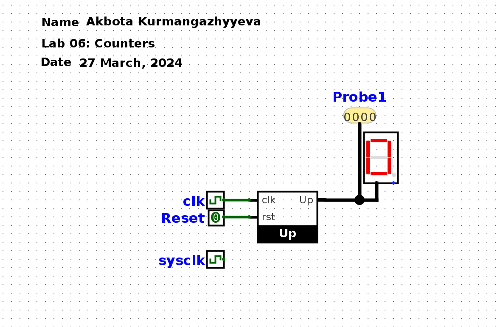
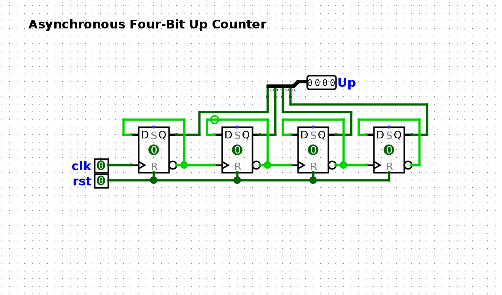
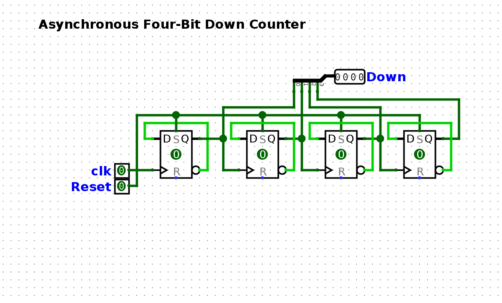
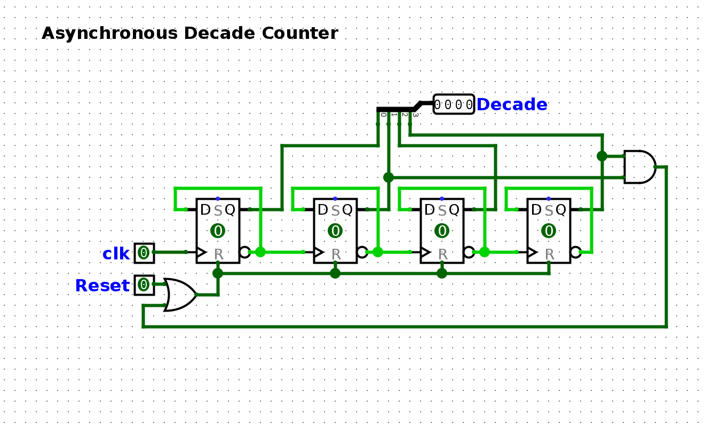
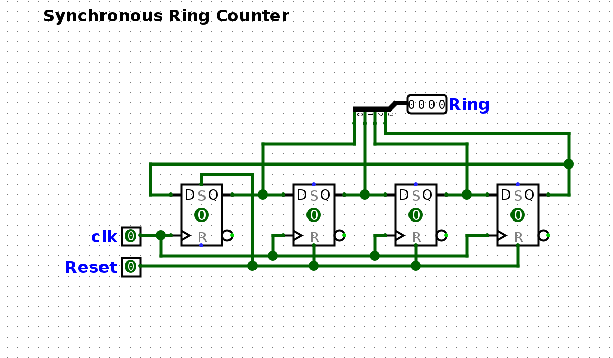
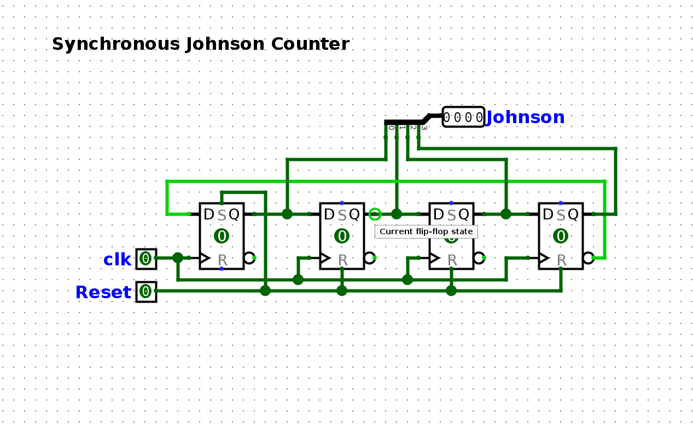

 Decade counter counts till 10 and re-sets the value to 0
 Ring counter shifts the single "1" to the left every time we increment the counter, making the cycle.
 Jognson counter goes like this 0001 0011 0111 1111 1110 1100 1000 0000 0001 and etc.
 

